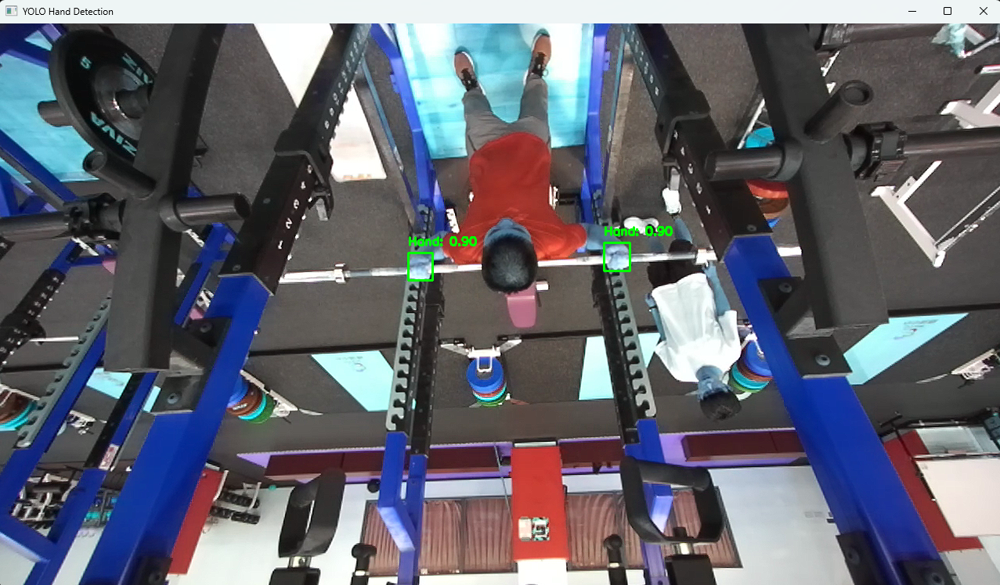
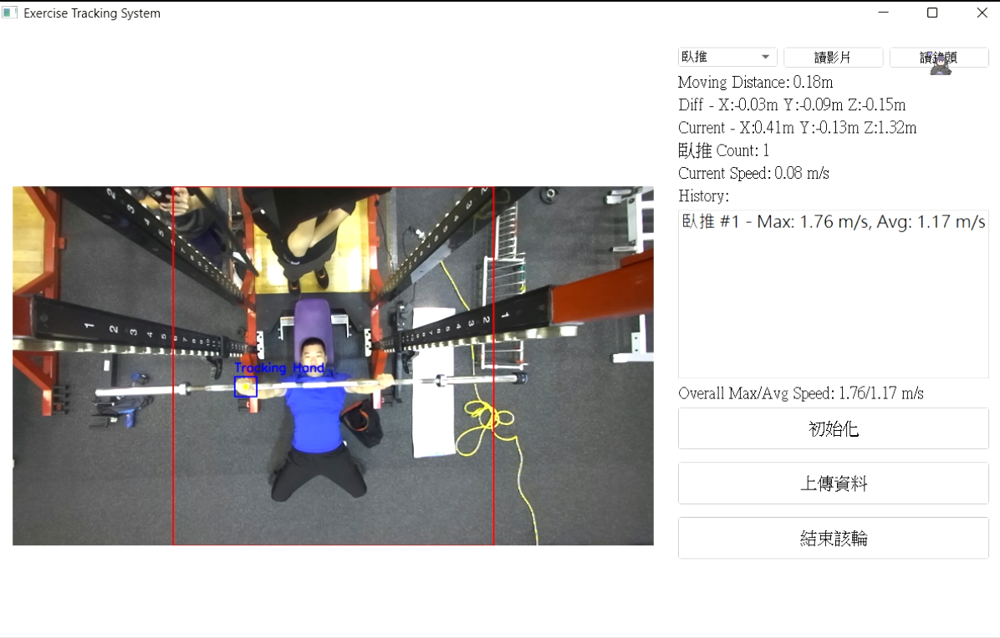
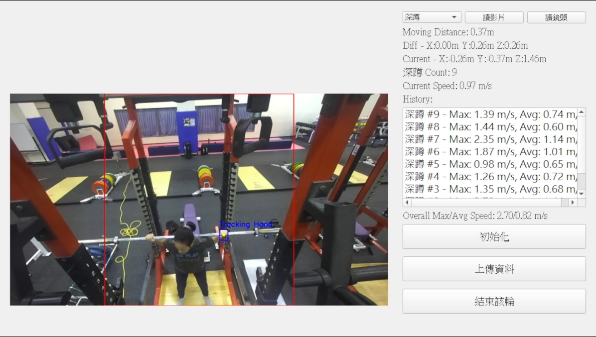

# AI-Powered Motion Tracking System
This project is a real-time exercise tracking system that uses YOLO (You Only Look Once) for object detection, the ZED Camera SDK for depth perception, and a PyQt5-based graphical user interface (GUI) for interaction. It is specifically designed to track and analyze exercises such as squats and bench presses, providing users with feedback on movements, repetitions, speed, and other metrics.

## Features

### Real-Time Hand Tracking:
- Detects hands using a custom YOLO model (`handsv2.pt`).
- Tracks the movement of the selected hand in exercises like bench press and squat.

### Depth Measurement:
- Uses ZED Camera for depth perception to calculate distances, positions, and velocity in 3D space.

### Interactive GUI:
- Built using **PyQt5**, offering an intuitive interface for users to:
  - Load video files (`.svo2`) or connect to a live camera.
  - View exercise-specific data such as repetitions, speed, and distances.
  - View tracking history and overall statistics.

### Predictive Tracking:
- Implements a predictive model to handle missed detections and ensure smooth tracking over multiple frames.

### Exercise Statistics:
- Tracks repetitions, speed (max/average), and distance of movements during exercises.
- Displays both real-time and cumulative statistics.

### Support for Video and Live Camera:
- Processes pre-recorded `.svo2` videos or live feeds from a ZED Camera.

---

## Dataset Collection and YOLO Model Training

- Collected a custom dataset of **12,000+ images** from multiple videos to detect hands during exercises.
- Manually annotated a subset of **1,500–2,000 images** using tools like **LabelImg** to create bounding boxes around hands.
- Trained a YOLO model with the following steps:
  1. Split the dataset into training and validation sets (80/20 split).
  2. Fine-tuned a pre-trained YOLO model on the custom hand dataset.
  3. Optimized for high precision and recall to accurately detect hand positions from different angles and lighting conditions.
  4. Saved the trained YOLO model as `handsv2.pt` for integration into the application.

---
## Demo Images

### Example Image 1:


### Example Image 2:


### Example Image 3:



## Requirements

### Software Prerequisites
- **Python** (>=3.8)
- **Dependencies**:
  - `ultralytics`: For YOLO object detection.
  - `pyzed`: For ZED Camera integration.
  - `PyQt5`: For the GUI framework.
  - `numpy`: For numerical calculations.
  - `opencv-python`: For image processing.

### Hardware Requirements
- A **ZED Camera** for live tracking and depth perception.
- A system with a CUDA-enabled GPU for real-time object detection with YOLO.

---

## Installation

### Clone the Repository:
```bash
git clone https://github.com/your-username/exercise-tracking-system.git
cd exercise-tracking-system


